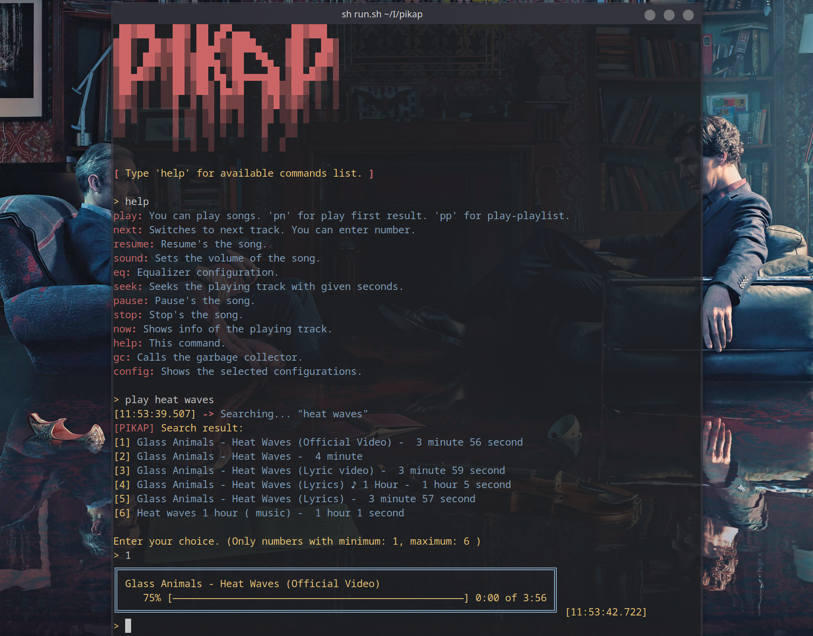
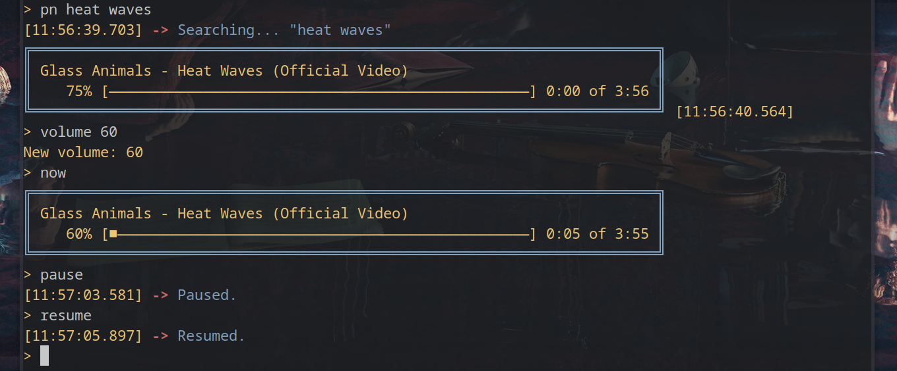

<h1 align="center">💿 pikap</h1>

CLI Youtube player without ads. Only audio stream from YouTube by [Lavaplayer](https://github.com/sedmelluq/lavaplayer).

### Features
1. Minimal system usage (~100MB Memory)
2. Fluent experience
3. Scalable
4. Easy to use
5. Many planned features

<h2 align="center">📸 Screenshots</h2>

<details>

<summary>Click here for screenshots</summary>


</br>


</details>

### How To Build And Run

I will also share the compiled files when <b>pikap</b> goes into beta version.

Requirements are: Maven3, JDK >= 11
```
git clone https://github.com/koply/pikap
cd pikap
mvn install
sh run.sh
```

### Task List
- [ ] Download option.
- [ ] Equalizer for player
- [ ] Local web page for remote control the player
- [ ] Database initialization and integration
- [ ] Storing information of past songs with SQLite
- [ ] Endless play mode with next suggested content from the song's YouTube page
- [ ] Discord RPC
- [x] More efficient input-output handler (maybe tui?)
- [x] Colorized console handler with Chalk
- [x] Enchance the play command
- [ ] Config commands
- [ ] Repeat and shuffle commands
- [ ] Previous/back command
- [ ] Queue/list command
- [ ] Optional: Output device selector
- [x] Optional: Advanced search command
